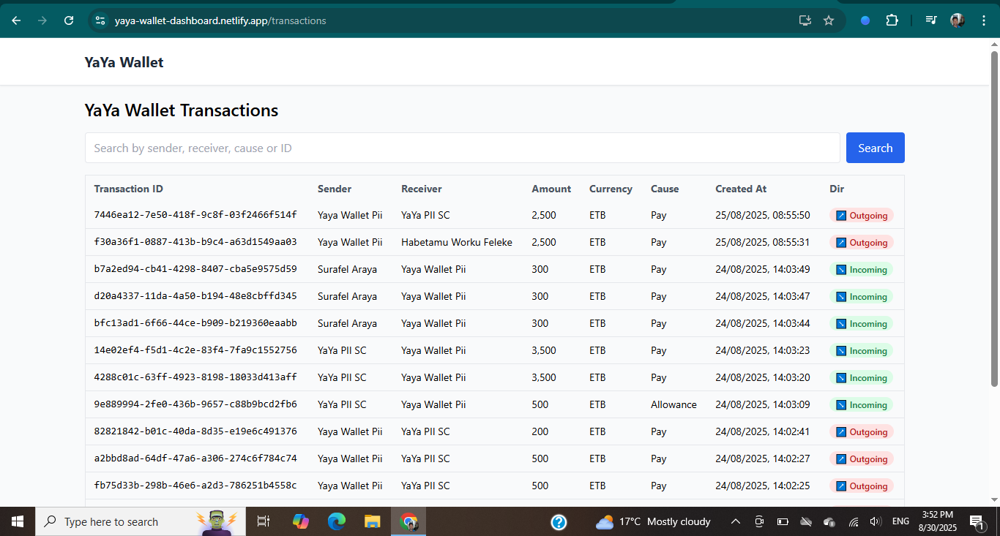
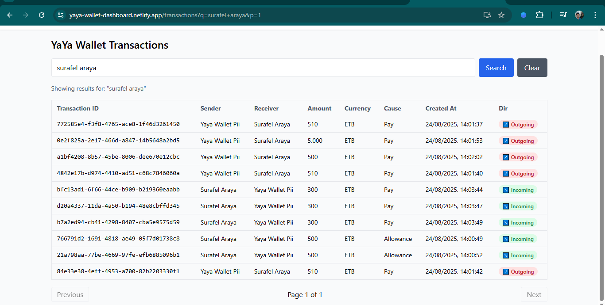

# YaYa Wallet Transactions Dashboard

[](https://yaya-wallet-dashboard.netlify.app)

A simple dashboard to view and search transactions from the YaYa Wallet API.

## Live Demo
Check out the live demo here: [yaya-wallet-dashboard.netlify.app](https://yaya-wallet-dashboard.netlify.app)

Backend API is deployed on Render: Can't share the link for security reasons.

## Table of Contents
- [Screenshots](#screenshots)
- [Features](#features)
- [Tech Stack](#tech-stack)
- [Implementation](#implementation)
  - [Backend Implementation](#backend-implementation)
  - [Frontend Implementation](#frontend-implementation)
- [How to Run Locally](#how-to-runtest-code-locally)
- [Assumptions](#assumptions)
- [Scalability](#scalability)

## Screenshots

### Dashboard


### Search Transaction


## Features
- Fetches transactions from the YaYa Wallet REST API (via NestJS backend proxy).
- Displays a tabular list with: 
  - Transaction ID, Sender, Receiver, Amount, Currency, Cause, Created At
  - Pagination (`?p=` query parameter support).
  - Search by sender, receiver, cause, or transaction ID.
  - Incoming/outgoing transactions highlighted visually:
    - **Green** → Incoming
    - **Red** → Outgoing
    - **Top-up** transactions (sender == receiver) treated as incoming.
  - Responsive UI using Tailwind CSS.

---

## Tech Stack
- **Backend**: [NestJS](https://nestjs.com/) (Node.js framework)
  - Handles API integration
  - HMAC signing for security (per YaYa Wallet spec)
  - Environment variable config (`.env`)
- **Frontend**: [React](https://create-react-app.dev/) + Tailwind CSS
  - Simple dashboard UI
  - React hooks for state management
  - Axios for API calls

---
## Implementation

### Backend Implementation

### 1. Project Setup

#### 1.1 Created a NestJS project to securely handle API communication and signing:

```bash
# Prereqs: Node 18+, npm 9+, Nest CLI
npm i -g @nestjs/cli

nest new backend
```
#### 1.2 Installed required dependencies:

```bash
npm install @nestjs/axios @nestjs/config class-validator class-transformer helmet
```
#### Project Structure
```
backend/
├── src/
│   ├── common/                            # Shared utilities and services
│   │   ├── time-offset.service.ts         # Handles server time offset with YAYA API
│   │   └── yaya-auth.util.ts              # Signing utility for authenticated requests
│   │
│   ├── modules/                           # Feature-based modules for scalability
│   │   └── transactions/                  # Transaction module (API integration)
│   │       ├── dto/                       # Data Transfer Objects
│   │       │   └── search.dto.ts          # DTO for transaction search
│   │       ├── transactions.controller.ts # Defines endpoints for transactions
│   │       ├── transactions.module.ts     # Module wiring
│   │       └── transactions.service.ts    # Core logic for API calls & signing
│   │
│   ├── app.module.ts                      # Root application module
│   └── main.ts                            # Application entrypoint
│
├── .env                                   # Environment variables (ignored in git)
├── package.json                           # Project dependencies & scripts
└── tsconfig.json                          # TypeScript configuration

```

#### 1.3 Set up .env to store sensitive information: 
```bash
YAYA_API_BASE=https://sandbox.yayawallet.com    # base url
YAYA_API_KEY=key-test_...                       # API KEY from YAYA Wallet
YAYA_API_SECRET=eyJ0eXAiOiJKV...                # API SECRET from YAYA Wallet
CURRENT_ACCOUNT_NAME=optional # The account name currently being used to determine incoming/outgoing  transactions
PORT=3001                                       # PORT NestJs app runs
```
**DoNot  commit .env file to github repo**
**This ensures API keys are not hardcoded and can be safely rotated if needed.**

### 2. Transactions Module
Created a transactions module to encapsulate all transaction-related logic.
```bash
nest generate module transactions
```
#### 2.1 Transactions Controller
created transactions controller which exposes endpoints for frontend consumption.
```bash
nest generate controller transactions
```
The TransactionsController is responsible for handling incoming HTTP requests related to transactions and mapping them to the appropriate service methods. It exposes three main endpoints:
```
GET /transactions
Accepts an optional query parameter p (page number).
Calls the service method getByUser() to fetch transactions for the currently authenticated user.
Returns a paginated response including both the page number and the transaction data.

POST /transactions/search

Accepts a request body containing the search query and optional paramenter p (page number).
Calls the service method search() to query the Yaya Wallet API for transactions matching the search term.
Returns a paginated response with the results.

GET /transactions/me
A simple endpoint to retrieve the account name of the current user, for now it is declared in the .env file under the CURRENT_ACCOUNT_NAME.
```

#### 2.2 Transactions Service
The TransactionsService is responsible for handling communication with the Yayawalet transaction API.
```bash
nest generate service transactions
```
#### 2.3 Search Transactions Dto - defines shape of search request body.
manually create the dto folder inside the transactions/ 

### 3. Backend Service Logic
TransactionsService is the core
#### 3.1 Configuration & Secrets
Pulls API base URL, key, secret, and optional current account name from .env using ConfigService

#### 3.2 Request Signing
Uses YaYa Wallet’s HMAC-based authentication:
Concatenate {timestamp + method + endpoint + body}
Hash with SHA256 HMAC using API_SECRET
Base64 encode → YAYA-API-SIGN header
**Signing code**
```bash
export function signRequest(params) {
    const { secret, method, endpoint, body, timestamp } = params;
    const bodyString = body ? JSON.stringify(body) : '';
    const prehash = `${timestamp}${method}${endpoint}${bodyString}`; # concatenate
    const hmac = crypto.createHmac('sha256', secret); 
    hmac.update(prehash); # SHA256 hashing
    const signature = hmac.digest('base64'); 
    return signature;
}
```

Only the endpoint path is signed, not full URL, query parameters are appended afterward (?p=1).

```bash
const endpoint = '/api/en/transaction/find-by-user';
const url = `https://sandbox.yayawallet.com${endpoint}?p=${page}`;
this.http.get(url, { headers: this.headers('GET', endpoint) });
```
#### 3.3 Headers Setup
Each request includes:
```bash
{
  'Content-Type': 'application/json',
  'YAYA-API-KEY': API_KEY,
  'YAYA-API-TIMESTAMP': timestamp,
  'YAYA-API-SIGN': signature
}
```

#### 3.4 Service Methods
```
getByUser(page = 1) – fetches paginated transactions for the current account.

search(query: string, page = 1) – searches transactions by sender, receiver, cause, or ID.

getCurrentAccountName() – optional helper for frontend to determine incoming/outgoing transactions.
```

#### 3.5 Time Offset Handling

TimeOffsetService ensures that YAYA-API-TIMESTAMP is synchronized with YaYa Wallet server time to prevent request expiry. i have used the time endpoint to query API server time.
```bash
# get the server time from this and save it as serverMs
# i use the 'https://sandbox.yayawallet.com/api/en/time' to get server time
const res = await firstValueFrom(this.http.get('https://sandbox.yayawallet.com/api/en/time'));
const serverMs = Number(res.data?.time); # Extract server time from object response
const localMs = Date.now();
this.offsetMs = serverMs - localMs;

```
### 4. Security Considerations
```
API keys are kept secret in .env.

Requests are signed, and sensitive data is never exposed to the frontend.

Endpoints are hardcoded, which is safe because they are public API paths.

Helmet middleware can be added for HTTP security headers.
```

### FrontEnd Implementation

### Project Setup

#### Create react app using the CRA template and install dependencies
```bash
# Create React application
npx create-react-app yaya-wallet-frontend
cd yaya-wallet-frontend

# Install required dependencies
npm install react-router-dom
npm install -D tailwindcss@3 postcss autoprefixer
npx tailwindcss init
```
#### Project Structure
```
src/
├── components/             # Reusable UI components
│   ├── Navbar.js           # Navigation header
│   ├── TransactionTable.js # Transactions display
│   ├── Pagination.js       # Pagination controls
│   └── Badge.js            # Status badges
├── pages/                  # Page components
│   ├── Dashboard.js        # Main transactions page
│   └── NotFound.js         # 404 error page
├── lib/                    # Utilities and APIs
│   └── api.js              # API communication
├── App.js                  # Main app component with routing
└── index.js                # Application entry point
```
#### Environment Configuration
Created .env file with environment variables:
```bash
# Backend api to make requests or you can change it to the deployed backend url like on render
REACT_APP_API_BASE=http://localhost:3001 
```
#### Core Components Implementation
API Service Layer (lib/api.js)
```
// Implemented API functions for:
// - fetchTransactions(page)
// - searchTransactions(query, page)
// - fetchCurrentAccount()
```

Reusable UI Components
```
Badge.js: Direction indicator (Incoming/Outgoing) with colored styling

Pagination.js: Page navigation controls with disabled states

TransactionTable.js: Main data table with transaction information
```
---
#### Dashboard Page (pages/Dashboard.js)
Key Features Implemented
```
Transaction Loading: Fetches paginated transactions from API

Search Functionality: Real-time search with query parameters

URL Synchronization: URL reflects current state (page, search query)

Responsive Design: Mobile-friendly layout with Tailwind CSS

Error Handling: Comprehensive error states and user feedback
```
Search Implementation
```
Dedicated search input with enter key support

Search button trigger (not on-type to reduce API calls)

Clear search functionality

URL updates to /search?q=query&p=page
```
Pagination System
```
Dynamic page calculation from API response, like res.data.lastPage

Next/previous navigation

URL parameter synchronization

Disabled states during loading
```
---
#### Transaction Table Component
Data Display
```
Transaction ID with monospace font, 
Sender and receiver information,
Amount formatting with locale-specific number formatting,
Currency display,
Cause/purpose field
Human-readable timestamp conversion
Direction badges (Incoming/Outgoing)
```
#### URL Management
Implemented React Router's:
```
useSearchParams() for query parameter management

useNavigate() for programmatic navigation

Route-based URL structure (/transactions, /search)
```
## How to Run/test code locally
### Backend — Run & Test Locally
1. Clone the Repository
```bash
git clone https://github.com/hadush-negasi/yaya-wallet-dashboard.git
cd yaya-wallet-dashboard/backend
```
2. Install Dependencies
Make sure you have Node.js (>=18) and npm/yarn installed.
```bash
npm install
```
3. Configure Environment Variables

Create a .env file in the backend folder (or copy from .env.example if available). For example:
```bash
API_KEY=your_api_key_here         # yaya-api-key
API_SECRET=your_api_secret_here   # yaya-api secret 
CURRENT_ACCOUNT_NAME=yayawalletpi # current user Account name
PORT=3001                         # Nestjs port
```
4. Run the Backend
```bash
npm run start:dev
```
The backend will run at:
👉 http://localhost:3001

5. Test the API (Postman / Thunder Client)

You can test using either Postman or the Thunder Client VSCode extension.

Example Requests:

1. Get Transactions (paginated)
```bash
GET http://localhost:3001/transactions?p=1
```
2. Search Transactions

This will search the transactions by sender, receiver, transaction id, cause, just put the it in the query key in the body section.
```bash
POST http://localhost:3001/transactions/search
Content-Type: application/json

{
  "query": "surafel araya"
}
```

3. Get Current Account Transactions

This will return the account for the dashboard to monitor for the incoming\outgoing, i have assumed the account name is 'yayawalletpi'.

for now i have put the account name in the .env file of backend, as CURRENT_ACCOUNT_NAME=yayawalletpi
```bash
GET http://localhost:3001/transactions/me
```
this will just read read the CURRENT_ACCOUNT_NAME from .env file and return it as json.

### Frontend Run locally
1. Clone the Repository
if you have already cloned the repo while trying to run the backend, no need to clone the repo again. just go to 
```bash 
cd client 
```

otherwise, clone the repo first
```bash
git clone https://github.com/hadush-negasi/yaya-wallet-dashboard.git
cd client
```
2. Install Dependencies
```bash
npm install
```
3. Environment Configuration
Create a .env file in the root directory with the following variables:
```bash
REACT_APP_API_BASE=http://localhost:3001  # Nestjs backend url to fetch data
```
4. Start the Development Server
```bash
npm start
```
5. Access the Application
Open your browser and navigate to:
```bash
http://localhost:3000
```
---
## Assumptions

- While integrating with the YAYA Wallet API, every transaction record retrieved from the `https://sandbox.yayawallet.com/api/en/transaction/find-by-user` endpoint contained the same account name: **`yayawalletpi`**.  
- Based on this observation, I assumed that the `yayawalletpi` account name could be used as a reference point to determine whether a transaction is **incoming** or **outgoing**.  
- This assumption was made to simplify the logic during development and testing. If the API provides more explicit flags in the future (e.g., `direction`, `type`), this logic can be updated accordingly.

## Scalability

- **Backend (NestJS)**
  - The backend is structured using a `modules/` folder. Each feature (e.g., `transactions/`) is encapsulated into its own **module**, with its corresponding **controller**, **service**, and **DTOs**.
  - This modular structure makes it easy to add new features (e.g., `users`, `accounts`, `payments`) without breaking existing functionality.
  - Shared utilities are centralized under `common/`, encouraging code reuse and reducing duplication.
  - By following NestJS best practices, we can also extend scalability further with:
    - Database integration (PostgreSQL, MongoDB, etc.) using Prisma/TypeORM.
    - Microservices (e.g., Kafka, RabbitMQ) if horizontal scaling is needed.
    - Caching (e.g., Redis) for improving API performance.

- **Frontend (React)**
  - The frontend is organized into `components/` and `pages/`, following a clean separation of concerns.
  - Currently, only a **Dashboard** page is implemented, but the structure allows adding more pages easily (e.g., **Account**, **Login**, **Transactions History**, **Settings**).
  - Components are designed to be **reusable** and **composable**, enabling faster UI expansion.
  - Future scalability can include:
    - State management (Redux, Zustand, or React Query).
    - Authentication & role-based access.
    - API pagination, filtering, and sorting support for large data sets.

- **Overall**
  - Both backend and frontend are designed with **extensibility** in mind.
  - New features can be added independently without tightly coupling different parts of the system.
  - The architecture can evolve into a **full-featured financial dashboard** with user management, reporting, analytics, and integrations.


## About the Author

**Hadush Negasi** – Computer Engineering Graduate | Full-Stack Developer  

- Passionate about building scalable web applications and modern dashboards.  
- Experienced with **NestJS**, **React**, **Node.js**, **MongoDB**, and **Firebase**.  
- Interested in API integrations, data visualization, and creating maintainable codebases.  
- GitHub: [github.com/hadush-negasi](https://github.com/hadush-negasi)  
- LinkedIn: [linkedin.com/in/hadush-brhane](https://www.linkedin.com/in/hadush-brhane/)  
- Location: Ethiopia


